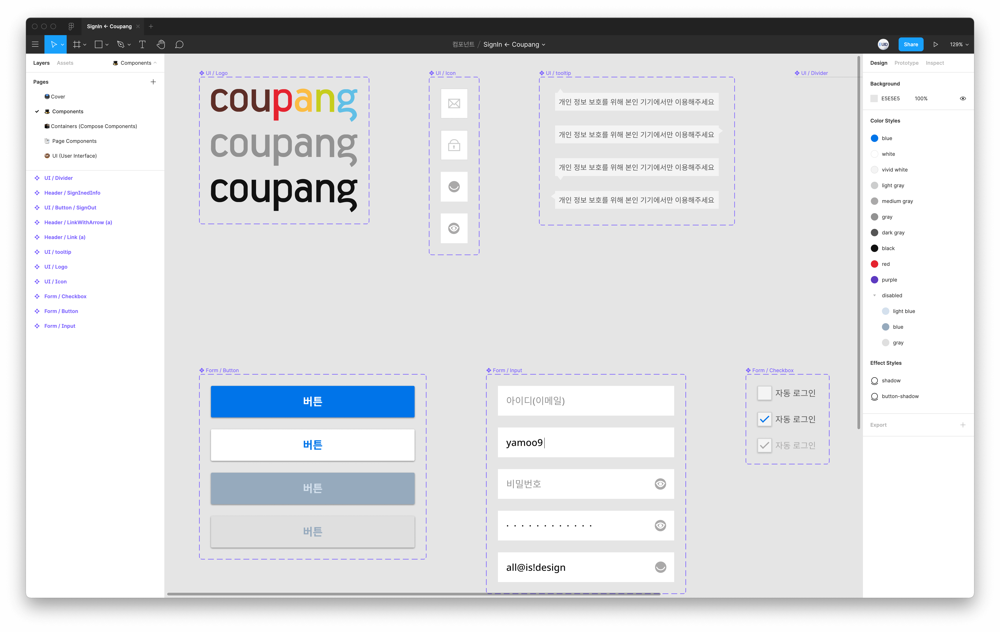
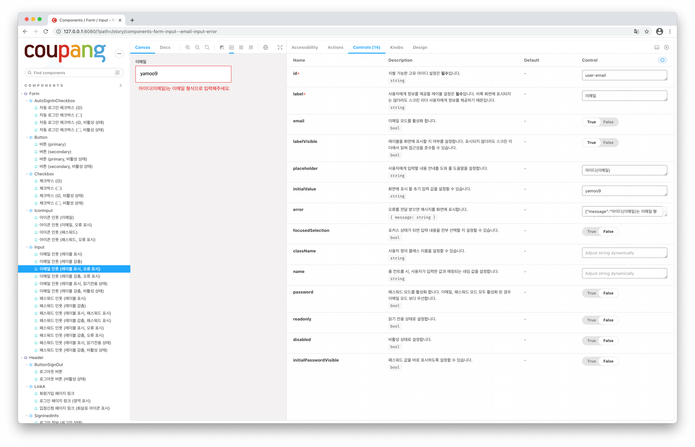
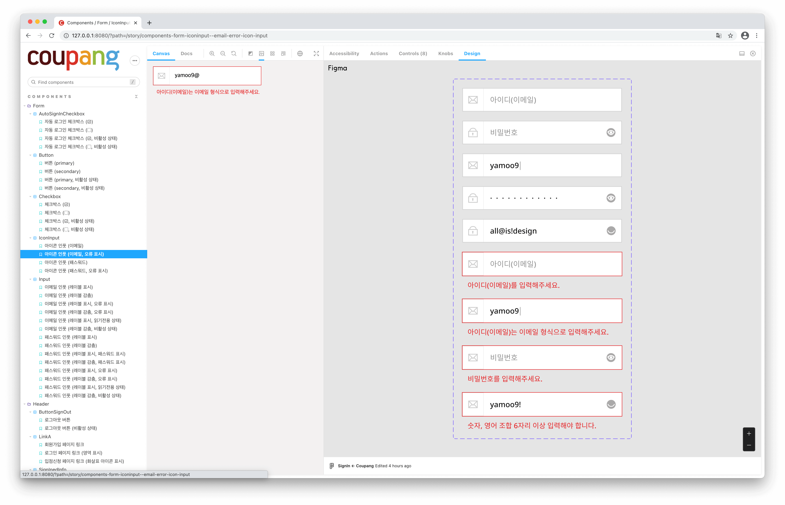
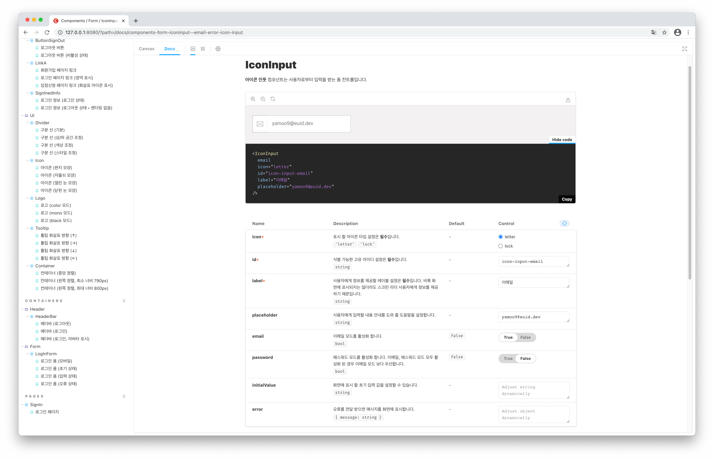
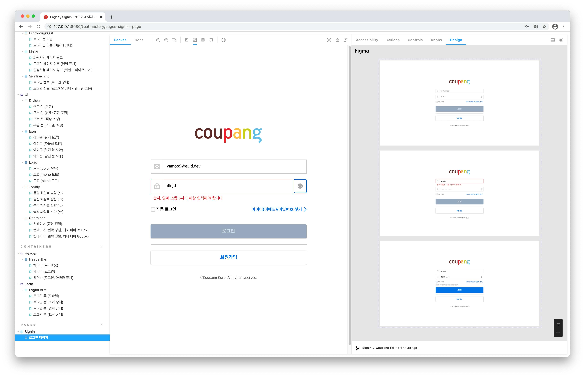

# 쿠팡! Design System

컴포넌트 주도 방식(Component Driven Development)을 활용해 작은 컴포넌트(components)부터 복합(compose) 컴포넌트, 페이지(page) 컴포넌트로 상향식(Bottom Up)으로 디자인 → 개발되었습니다.
디자인, 개발에 사용 된 도구는 다음의 3가지입니다.

- Figma
- React
- Storybook

 

## 컴포넌트 주도 개발 경험 (CDD Expreience)

컴포넌트부터 시작하는 디자인 워크 플로우와 개발 워크 플로우가 매우 유사하여 UI 디자인과 개발을 동시에 진행할 수 있습니다.

### 컴포넌트 디자인 (Design)

Figma를 사용해 컴포넌트(components), 컴포넌트 배리에이션(variation), 상태(state)를 디자인 한 후, 컴포넌트를 조립한 컨테이너(containers) 컴포넌트를 만들거나, 페이지(pages) 컴포넌트를 구성할 수 있습니다.

### 컴포넌트 개발 (Develop)

디자인 워크플로우와 동일한 방법으로 React를 사용해 UI를 구성하는 컴포넌트를 개발합니다. 개발 된 컴포넌트는 Storybook을 사용해 UI 컴포넌트 라이브러리 문서를 실시간으로 구성할 수 있습니다.

Design 패널을 통해 컴포넌트 개발 결과와 Figma 디자인 결과를 비교하여 실제 결과물을 만들어 냅니다.

개발 된 컴포넌트는 문서화 되어 다른 개발자가 쉽게 가져다 쓸 수 있습니다. 사용 가능한 전달 속성(props), 속성 별 사용 가능한 타입(types), 기본 값 등을 확인할 수 있고
실시간으로 인터랙션하여 결과를 확인할 수도 있습니다.

컴포넌트를 조립해 구성한 페이지 컴포넌트는 실제 앱에서도 작동되는 것처럼 결과를 확인할 수 있습니다.

 
 

 ——— E.UID ——— 

 
 
 

Copyrightⓒ2021 <a href="https://euid.dev" target="_blank">이듬(E.UID)</a> All rights reserved.

